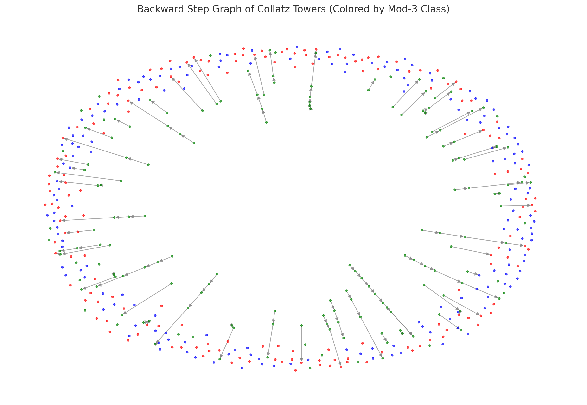

# Collatz Towers Analysis

## Overview
This repository contains an in-depth analysis of the Collatz map using **topological data analysis (TDA)**. The core idea is to investigate the **tower structures** formed by applying the Collatz transformation iteratively and analyzing their connections through **2-adic valuations**, **mod-3 classes**, and **KeplerMapper visualizations**.

## Problem Statement
The Collatz function is defined as:
$$
C(n) = \begin{cases}
    \frac{n}{2}, & n \equiv 0 \mod 2 \\
    3n+1, & n \equiv 1 \mod 2
\end{cases}
$$
Instead of analyzing the standard trajectory of numbers, we focus on the **reverse Collatz process**, examining the inverse map:
$C^{-1}(n) = \{2n, \frac{n-1}{3} \textrm{ if } n-1 \equiv 0 \mod 3 \}$
Each number **n** can be associated with a **tower structure**:
$C(n) = 2^{v_2(3n+1)} \cdot w$
where $v_2(3n+1)$ is the **2-adic valuation** of $3n+1$, and $w$ is an odd number.

By studying these towers, we analyze **how different numbers map to each other** and how their topological structures emerge.

## Methodology
1. **Dataset Generation**
   - Compute the 2-adic valuation \( v_2(3m+1) \) for numbers \( m \) in a given range.
   - Identify towers \( 2^k w \) and classify them by mod-3 classes.
   - Construct the **backward step graph**, where edges represent numbers mapping backward in the Collatz process.

2. **Topological Data Analysis (TDA) with KeplerMapper**
   - Apply **UMAP** for dimensionality reduction.
   - Construct **Mapper graphs** to visualize high-dimensional data.
   - Cluster nodes using **DBSCAN** to detect structural patterns.

3. **PCA & Clustering Analysis**
   - Perform **PCA** on Mapper graphs to analyze structural variation.
   - Use **K-Means clustering** to group similar graph structures.
   - Identify the **most and least clustered numbers** to detect potential attractors.

4. **Network Analysis**
   - Compute **degree centrality** and **betweenness centrality** to identify critical nodes.
   - Analyze mod-3 classes to determine their role in connectivity.
   - Visualize clustering properties to see how local connections form.

## Results & Visualizations
### **4️⃣ KeplerMapper Graph for d=7, n_neighbors=30**

- This visualization represents the **topological structure** of the Collatz backward graph, mapped using KeplerMapper.
- **UMAP dimensionality reduction** is applied to preserve meaningful distances between points in high-dimensional space.
- **Nodes represent clusters of numbers** that are structurally similar in their backward trajectories.
- **Edges indicate topological overlap** between clusters, showing where numbers share common paths in their preimages.
- The formation of **distinct connected components** suggests the existence of hierarchical relationships between certain numbers in the Collatz process.
- The largest, highly connected clusters correspond to **attractors**—numbers that accumulate many preimage mappings.
- **Sparse and isolated nodes** indicate numbers with fewer backward connections, meaning they originate from more constrained trajectories.

**📌 Explore the interactive KeplerMapper visualizations here:**  
▶️ **[Collatz Mapper Interface](https://bobovski66.github.io/reverse_Collatz_clustering/mapper_outputs/index.html)**

### **Backward Step Graph of Collatz Towers**

- Each node represents a number in the Collatz process, color-coded by mod-3 class.
- Directed edges indicate valid backward steps, revealing hierarchical structures.

### **PCA-Based Clustering of Collatz Mapper Graphs**

- Principal Component Analysis (PCA) reveals how different Mapper graphs separate in feature space.
- Three distinct clusters emerge, corresponding to different levels of connectivity and structure.

### **Visualization of Most & Least Clustered Nodes in Collatz Backward Graph**

- **Red nodes**: Most clustered, forming highly connected hubs.
- **Blue nodes**: Least clustered, sparse and isolated numbers.


## Conclusion
- **Towers in the Collatz process exhibit structured connectivity**, influenced by **2-adic valuations and mod-3 residues**.
- **Higher-dimensional embeddings capture complex relationships**, while **PCA and clustering reveal distinct structural behaviors**.
- **Certain numbers act as attractors**, forming hubs in the backward graph, while others remain sparsely connected.

## How to Use This Repository
1. Clone the repository:
   ```bash
   git clone https://github.com/your-repo/collatz-towers-analysis.git
   ```
2. Install dependencies:
   ```bash
   pip install numpy pandas matplotlib networkx umap-learn kmapper
   ```
3. Run the analysis notebooks to reproduce results.

🚀 This project uncovers hidden **topological structures in the Collatz process** using modern data science techniques!

